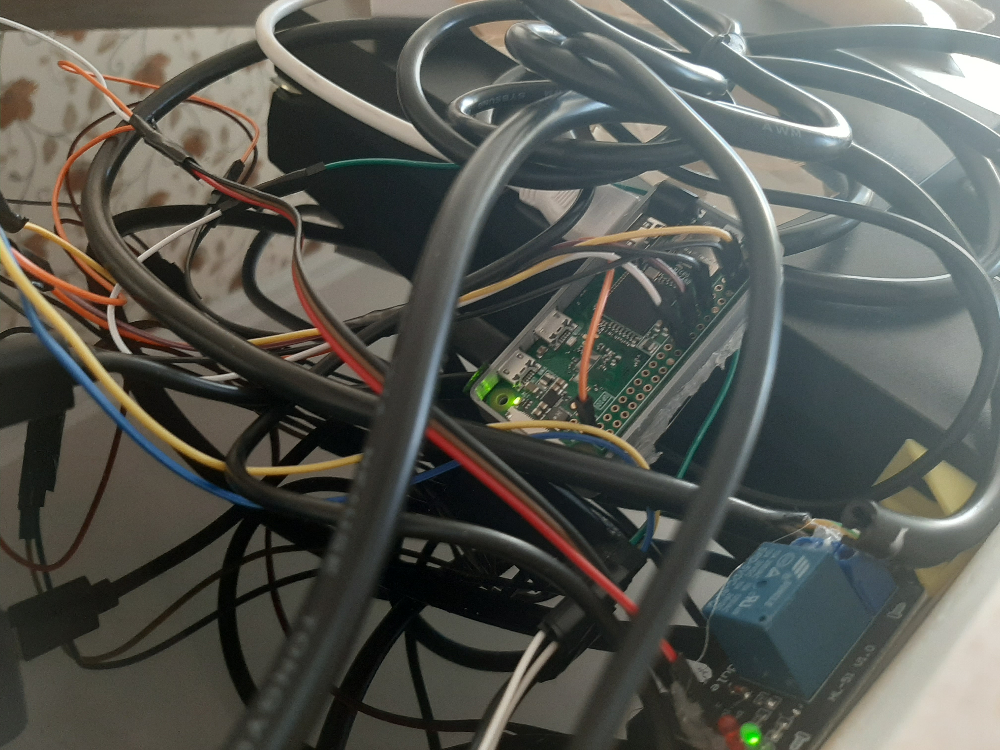

# MagicMirror
Turkish Guide
Raspberry Zero ile Akıllı Ayna yapımı ve yaparken karşılaştığım sorunlar.

### Gereken donanım,eşyalar ve fiyatları
*  Raspberry Pi Zero Wireless(W veya WH) - 85₺ - [Link](https://market.samm.com/raspberry-pi-zero-w)
*  Monitör için Konya'da bulunan bilgisayarcılar çarşısına gittim ve esnafları gezerken ayağı kırık bir şekilde Samsung 19" monitör buldum. - 150₺
*  Mini HDMI to VGA çevirici(Monitörünüz HDMI destekliyorsa Mini HDMI to HDMI kablosu alabilirsiniz.) - 35₺ - Esnafdan alındı aynı ürün [burada](https://urun.n11.com/diger-bilgisayar-yedek-parcalari/mini-hdmi-to-vga-kablo-cevirici-donusturucu-hdmi-ses-destekli-bst-P219387924?gclsrc=aw.ds&&gclid=CjwKCAjwsO_4BRBBEiwAyagRTVnHPqpTWFgqWJqJPgQ0x-ZhH-cBtHG7TYB-0Lu3BZf1d-UIT6rNThoCp8YQAvD_BwE) da bulunuyor.
*  5V 3A adaptör - 30₺ ama kuponla 10₺'ye aldım. - [Link](https://www.trendyol.com/syrox/3-0-amper-sarj-aleti-p-5562839)
*  Heatsink kullanmadım ama kullanmanızı kesinlikle öneriyorum. - [Örnek Link](https://market.samm.com/raspberry-pi-sogutucu-set)
*  PIR Sensör (Neden kullandığım aşşağıda mevcut.) - 10₺ - Esnafdan alındı aynı ürün [burada](https://www.robotistan.com/hc-sr501-ayarlanabilir-ir-hareket-algilama-sensoru-pir) da mevcut.
*  5V Röle Kartı (Neden kullandığım aşşağıda mevcut.) - 5₺ - Esnafdan alındı aynı ürün [burada](https://www.robotistan.com/1-way-5v-relay-module-tekli-5v-role-karti) da mevcut.
*  Micro SD Card, ben 16GB kullandım 8GB kullanmanızı önermem. - 30₺ -  A101'den aldım ayın ürün [burada](https://www.hepsiburada.com/sandisk-ultra-16gb-80mb-s-microsdhc-microsdxc-uhs-i-hafiza-karti-sdsquns-016g-gn3mn-p-HBV0000084R77?magaza=Hepsiburada&wt_gl=cpc.6805.shop.nelk.foto-aksesuar-ssc&gclid=CjwKCAjwsO_4BRBBEiwAyagRTTUYnhCSyu9SB2iAu_guk18WVbce5p-6DK112QeTrl7xf_MC-wYSERoCAIEQAvD_BwE) da mevcut.
*  Çerçeve (100x60cm) - 75₺ - Marangozdan yaptırıldı.
*  Reflekte Cam - 80₺ -  Camcıdan kestirildi, arkasına siyah araba filmi kapladım.
*  Biraz lehim teli, havya ve lehim bilgisi (PIR ve Röle için)(WH versiyonu aldıysanız gerekli değil.)
*  Erkek-Dişi jumper kablo (PIR ve Röle için)
*  Micro SD Card okuyucu  
*  Micro USB kablosu
*  VGA Kablosu
### Gereken yazılımlar
*  Gereken yazılım son sürüm [Raspbian](https://www.raspberrypi.org/downloads/raspberry-pi-os/) burada kullanacağınız Raspbian: Lite sürümü olmamalı, önerilen yazılımlar işimize yaramasa da yükleyip yüklememek size kalıyor. Ben burada "Raspberry Pi OS (32-bit) with desktop" Mayıs 2020 sürümünü kullandım.
*  Raspberry Zero için derlenmiş özel yükleme scripti:
  #### bash -c "$(curl -sL https://raw.githubusercontent.com/sdetweil/MagicMirror_scripts/master/raspberry.sh)"
*  Windows kullanıcısıysanız WinSCP ve Putty programlarını şiddetle öneriyorum, düzenleme ve kontrol açısından çok işimize yarıyorlar. [WinSCP](https://winscp.net/eng/downloads.php) - [Putty](https://winscp.net/eng/downloads.php#putty)
*  SD Card Formatter [Link](https://www.sdcard.org/downloads/formatter/)
*  Balena Etcher [Link](https://www.balena.io/etcher/)	
*  VNC Viewer [Link](https://www.realvnc.com/en/connect/download/viewer/)

## Raspberry Zero'nun hazırlanması
* Öncelikle SD Card okuyucumuza SD Cardımızı takıyoruz ve bilgisayara yerleştiriyoruz. SD Card Formatter uygulamasından kartımızı biçimlendiriyoruz. Daha sonra Balena Etcher uygulamasından indirdiğimiz Raspbian imajını seçip Flash işlemini başlatıyoruz ve bitmesini bekliyoruz(Bilgisayar ve SD Card özelliğine göre 2-7 dk arası sürebilir.). Flash işlemi bittikten sonra program otomatik kartımızı bilgisayardan çıkaracağı için SD Card okuyucumuzu sök-tak yapıyoruz. SD kartımızı bilgisayara tekrar taktıktan sonra disklerden boot olana giriyoruz ve diskin içine içi boş bir dosya oluşuturup ismini " ssh " koyuyoruz(Bu noktada dosyanın herhangi bir uzantıya sahip olmadığını kontrol edin.). Daha sonra " wpa_supplicant.conf "  dosyası oluşturuyoruz ve belirtilen kodları içine yazıyoruz.
````
ctrl_interface=DIR=/var/run/wpa_supplicant GROUP=netdev
update_config=1

network={
 ssid="WLAN isminiz."
 psk="WLAN şifreniz."
}
````
* Kodları içine yazarken veya kopyalarken WLAN isminizi ve şifrenizi yazmayı unutmayın.
* Bu işlemleri tamamladıktan sonra SD kartımızı bilgisayardan söküp Raspi'ye takabilir ve gücünü verebiliriz. Bu aşamada ekran mevcut ise bağlayınız ve açılma aşamalarını kontrol edin(Zorunlu değil.). Açıldıktan sonra Raspimizin ip adresini öğrenelim bunu modem arayüzünüzden öğrenebilirsiniz. Bunun için internetten yardım alabilirsiniz. Raspimiz açıldı ve ip adresini öğrendiğimize göre şimdi gelelim nasıl bağlanacağımız kısmına bunun için Putty programını çalıştırıyoruz. Putty programı açıldıktan sonra " Hostname or IP adress " yazan kısma raspimizin ip adresini yazıp open diyoruz, bu işlemi sürekli tekrarlamak istemezseniz "Saved Session" kısmına bir isim yazıp sağ tarafından Save diyebilirsiniz. Terminalimiz açıldığı zaman bize kullanıcı adını soracaktır raspinin varsayılan kullanıcı adı " pi " şifresi ise " raspberry "dir. Bilgilerimizi girdikten sonra işlemler başarılı ise pi@ipadresi şeklinde terminalimiz açılacaktır. Bu kısımda VNC seçeneğini aktif etmek için terminale " sudo raspi-config " yazıyoruz ve enterliyoruz. Açılan ekranda Interfacing Options seçeğini seçiyoruz ve enterlıyoruz. Açılan ekrandan VNC seçeneğinin üstüne gelip enterlıyoruz ve bize sorulan soruya onay veriyoruz. Daha sonra tekrar terminal ekranına gelip " sudo reboot " komutunu yazarak raspiyi yeniden başlatıyoruz. Raspi açıldıktan sonra artık bilgisayarımızın masaüstüne uzaktan bağlanabilir ve kontrol edebiliriz şimdi gelin bunu test edelim. VNC Viewer programını çalıştırıyoruz, yukarıdaki " Enter a VNC Server adress or search " yerine IP adresimizi yazıp enterlıyoruz ve bize sorulan kullanıcı adı ve şifremizi giriyoruz " pi:raspberry ". Herhangi bir sorunla karşılaşmadıysanız karşınızda raspinin masaüstü! Şimdi gelin MagicMirroru kurmaya başlayalım.
### MagicMirror kurulumu
* Önceki adımları başarıyla tamamladıysanız sizi tebrik ediyorum ve gelin şimdi Ayna yazılımını kuralım.
* Bu aşamayı ister Putty terminali üzerinden isterseniz de VNC Viewer ile bağlanıp Raspi terminali üzerinden yapabilirsiniz fakat ben size Putty'i öneriyorum.
* Terminalimiz açıldığı zaman " sudo apt-get update && apt-get upgrade " komudunu uyguluyoruz ve son güncellemeleri yüklüyoruz(10dk kadar alabilir internet hızına göre.).
* Gereken yazılımlar kısmında belirtmiş olduğum bash komutunu kopyalıyoruz ve terminalimize yapıştırıyoruz. Putty programını kullanıyorsanız sağ tık ile yapıştırabilirsiniz. Enterladığımız anda yükleme işleminiz başlamış olacak ve bu işlem çok uzun sürebilecektir(20-40dk) bu yüzden eğer ki Putty kullanıyorsanız Putty programını kapatmamanız Raspi'yi ve bilgisayarınızı internetten kesmemeniz gerekmektedir.
* Gerekli adımları yaptıysanız ve kurulum bittiyse MagicMirror otomatik olarak açılacaktır. Putty ekranında bu görüntüyü göremeyeceksiniz fakat ekranınızda yada VNC Viewer uygulaması ile görüntüleyebilirsiniz. Yazılım bilgisayar açıldıktan sonra yaklaşık 3dk'da açılmaktadır. Ekranı görünüyor takvim ve saat modülü sorunsuz çalışıyorsa buyrun gelin şimdi config dosyamızı ve modüllerimize göz atalım.
* Ben bu aşamada modül olarak MMM-LICE modülünü ve MMM-MyPrayerTimes modülünü kullanmaktayım.
* Lice modülü günlük döviz miktarını gösteren bir model. Saatlik versiyonu maalesef bulunmuyor ama elimden gelirse kendim yazıp paylaşacağım.
* MyPrayerTimes modülü ise isminden anlaşılacağı üzere bulunduğunuz lokasyonun ezan vakitlerini gösteriyor.
* Modül yükleyip yüklememek size kalmış bir şey. Diğer modüllerin hepsi [bu](https://github.com/MichMich/MagicMirror/wiki/3rd-party-modules) sayfada mevcut.
* Modüllerin ne işe yaradığını anladığımıza göre gelin modülleri nasıl kuracağımıza bakalım.
### Modüllerin Kurulumu
* Öncelikle kurmak istediğimiz modülün github sayfasına gidiyoruz, ben burada örnek olarak MyPrayerTimes modülünü alıyorum.
* Modülün [GitHub](https://github.com/htilburgs/MMM-MyPrayerTimes) sayfasına gittiğimiz zaman açıklama kısmında hangi komutların uygulanacağına bakabilirsiniz kısaca ben ne işe yaradıklarını anlatayım.
* " cd ~/MagicMirror/modules " komutu bizim modül klasörümüze giden komuttur.
* " git clone https://github.com/htilburgs/MMM-MyPrayerTimes " komutu bize gerekli olan dosyaları klonlamaya(indirmeye) yarayan komuttur.
* " cd MMM-MyPrayerTimes " komutu bizim inen modül klasörüne giden komuttur.
* " npm install " komutu bizim modülümüz için gerekliyse node eklentilerini kurmaya yarayan komuttur. Bu komut modülün büyüklüğüne ve istediği eklenti sayısına göre uzayabilir yada HATA verebilir. Burada hatayı genellikle electron eklentisi üzerinden alıyoruz. Raspberry Zeroya electron yüklenemediği için yada yüklenip de düzgün çalışmadığı için genellikle hata verir, hatayı çözmek için modülün github sayfasına bir issue oluşturmamız ve hatayı belirtmemiz gerekir. Eğer ki sorun çözülebilecek bir problem ise çözümünü zaten belirtir yapımcıyı yada herhangi biri fakat çözümü yok isek o modülü maalesef yükleyemeyiz. Electron problemi almamak için Pi 3b ve üstü sürüm gerekir onun içinde farklı bir yükleme sayfasına bakabilirsiniz ben bu konuda sadece pi zero'ya yüklenmesi hakkında bilgi vereceğim.
* Modülün configuration kısmında belirtilen kod satırları bizim config dosyamıza eklememiz ve düzenlememiz gereken satırlardır. Bu ayarları ister config dosyasından isterseniz modülün kendi dosyasından değiştirebilirsiniz. Modülün kendi dosyasından değiştirirseniz config dosyasına herhangi bir ayar yazmadan sadece altta belirtilen şekilde yazmamız gerekir. Ben kendi prayertime modül dosyamı sayfama bırakıyorum.
````
{
  module: 'MMM-MyPrayerTimes',
  position: 'Konumu',
  header: 'Başlık',
  config: {
	  }
},
````
* Modülü başarıyla kurduysak terminalimize " pm2 restart 0 " yazarak aynamızın yazılımını yeniden başlatıyoruz. 2dk kadar sürebilir.
* Bu esnada ayna açıldıktan sonra logları kontrol etmek için " pm2 logs --lines=100 " komudunu uygulayabilirsiniz.
* Eski logları silmek için " pm2 flush " komudu kullanılır ve benim size tavsiye ettiğim yeni bir modül yüklediğinizde önce " pm2 stop 0 " ile yazılımı kapatmanız " pm2 flush " ile logları temizlemeniz ve " pm2 start 0 " yazılımı ve logları baştan açmanızı öneririm. Bu şekilde hata takibi daha kolay ve daha verimli olacaktır.
#### MMM-LICE modülünü ana birim TRY olacak şekilde düzenledim ve modülü indirdikten sonra config dosyamdan örnek alıp config dosyanızı oluşturabilir sonrada modül dosyasını benimki ile değiştirerek ana birimi TRY yapabilirsiniz.
* Modül kurulumunu da anlattığımıza göre artık yapacak tek şeyimiz takvim ve hava durumu modüllerini düzenlemek.
### Default modüllerin düzenlenmesi
* Bu esnada default gelen takvim, hava durumu ve haber modüllerini düzenleyeceğiz.
* Bunun için ~/MagicMirror/config klasörüne giriyoruz. Eğer WINSCP kullanıyorsanız çift tıklayarak config.js dosyasını düzenleme modunda açabilirsiniz bu esnada winscp kullanmanızı şiddetle öneriyorum çünkü putty üzerinde dosya düzenlemek insanın saçlarını söküyor :). Dosyayı düzenlerken gereken şeyler Google Takvim linkiniz ve OpenWeatherMap API keyiniz.
* İlk olarak hava durumunu düzenleyelim bu esnada [bu](https://openweathermap.org/price) linke girip Free olan kısımdan GET API KEY tuşununa basıyoruz ve üye olup API keyimizi alıyoruz. İsmini şehrinizin ismini koyabilirsiniz. API keyi aldıktan sonra kopyalıyoruz bulamıyorsanız [bu](https://home.openweathermap.org/api_keys) sayfaya gidip kopyalayabilirsiniz bunu bir yere not ediyoruz.
* Şimdi şehir kodumuzu bulalım bunun için openweathermap sayfasından şehrimizin hava durumunu açıyoruz. Ben Konya'nınkini açıyorum. Linkimiz örnek olarak şöyle olacak şehrimizi açtıktan sonra " https://openweathermap.org/city/306569 " sondaki 306569 Konya'nın şehir kodu oluyor. Şimdi config dosyamıza tekrar gelelim. Bu kısımda currentweather kısmını buluyoruz ve location kısmını şehir isminizi yazıyorsunuz baş harfi büyük ve ing olacak şekilde örn Istanbul,Izmır,Usak gibi. LocationID kısmına şehir kodumuzu ve appid kısmına ise API keyimizi yazıyoruz. Bunların hepsi tırnak içinde olacak bunu atlamayalım.
* Weatherforecast kısmına da aynı işlemleri uyguluyoruz burada değiştirmemiz kısım header: kısmı bu kısma türkçe olarak ben Hava Durumu yazdım. Bu ekranda görünecek başlık kısmı. Her şeyi yaptıktan sonra winscp editörünü ctrl+s diyerek kaydediyoruz ve dosyayı otomatik olarak yüklüyor winscp hata almamaya dikkat edin.
* Şimdi gelelim takvimi yüklemeye bu kısımda Google Takvime(calendar.google.com) giriyoruz internet tarayıcımızdan. Sağ üstte ayar menüsünden ayarlara giriyoruz. Sol tarafda takvimlerimin ayarları kısmından takvimi seçip giriyoruz. Aşağıya indiğimizde iCal biçiminde gizli adres başlığı altında bir link görüyoruz, bu linki kopyalayıp not ediyoruz.
* Ardından config dosyamızın calendar başlığı altında header sekmesini türkçeye çevirip düzenliyoruz ben Takvimim Ve Özel Günler yazdım. Calendars kısmında yazılı olan linki silip tırnak içinde yine kendi iCal linkimizi yapıştırıyoruz. Bu kısımda bu kadar ctrl+s diyerek yine kaydedebilirsiniz.
* Şimdi gelelim haber düzenlemeye bu esnada config dosyamızdan newsfeed modülüne gelip title olan kısma haber sitesinin ismi ve url kısmına haber sitemizin besleme linkini yazıyoruz. Birden fazla haber sitesi yazmak için benim config dosyamı örnek alabilirsiniz.
* Bazı haber sitelerinin besleme linkleri : [Link](https://haberss.mertskaplan.com/Haber_sitelerinin_RSS_adresleri)
### PIR ve Röle kartının bağlantıları
* Bu bağlantılar için raspimizin gpio pinlerini kullanıyoruz.
* Pi'nin hangi pinine bağlayacağınız size kalmış ben buraya hangi pinlerin güç,ground ve veri hattı olduğunu belirten bir [link](https://pi4j.com/1.2/images/j8header-zero.png) bırakıyorum.
* Bu esnada monitörünüzün herhangi bir ekran yansıması olmadığı zaman kapanma modu varsa röleye ihtiyacınız yok. Fakat benim monitörümde böyle bir özellik olmadığından dolayı ben monitörün gücünü keserek bu işlemi gerçekleştiriyorum. Eğer röle kullanmıyorsanız size uygun olan PIR modülünü modüller sayfasından bulup kurarak bu işlemi gerçekleştirebilirsiniz. Eğerki özellik yoksa benim gibi biraz daha beklemeniz gerekmekte.
* PIR sensör ve röle kartının çalışması için hala uğraşıyorum.
## Aynamın Fotoğrafları





